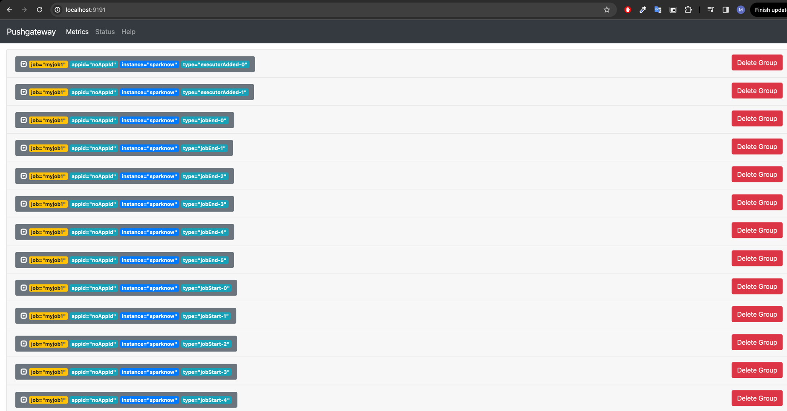
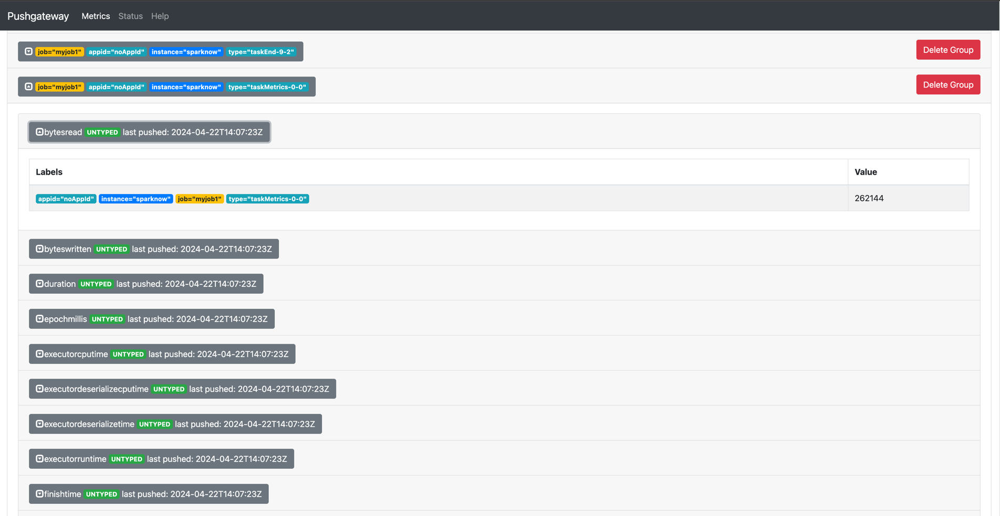

# Sparknow

<p align="center">
  
</p>


The Sparknow plugin is a Scala application that uses Spark listeners to collect metrics from key Spark methods and send them to the Prometheus Pushgateway o a Kafka Topic for monitoring the performance of Spark jobs.

The project consists of two modules, **sink** and **spark-job**, the former is the actual plugin that collects the metrics, the latter is a very simple example spark job that performs a word count of a book, it was added for testing and experimentation purposes only.

Plugin has been tested with spark versions 3.3.1 through 3.5.1

## Metrics

The following methods are the ones that are tapped to collect metrics, for the full list of values that are collected for each action see the code directly

- **onTaskStart** (only if extended mode is enabled).
- **onTaskEnd** (only if extended mode is enabled).
- **onStageSubmitted**
- **onStageCompleted** 
- **onExecutorExcluded** 
- **onExecutorAdded** 
- **onExecutorRemoved**
- **onOtherEvent**
- **onJobStart**
- **onJobEnd**


## Application Properties

| Property Name	                              | Default     | Meaning                                                                                                                                                                    | 
|---------------------------------------------|-------------|----------------------------------------------------------------------------------------------------------------------------------------------------------------------------|
| spark.sparknow.jobname       | no-job-name | Use this parameter to set the job name                                                                                                                                     | 
| spark.sparknow.extendedmode            | false       | Use this parameter to set the plugin to "extended" mode. extended mode also collects metrics at the task level, beware it may cause a large amount of data on the network. |
| spark.sparknow.pushgateway              | None        | Use this parameter to set address and port to connect to the pushgateway.                                                                                                  | 
| spark.sparknow.kafkaBroker | None        | Use this parameter to set the address(es) of the Kafka brokers.                                                                                                            | 
| spark.sparknow.kafkaTopic | None        | Use this parameter to set the target topic kafka metrics.                                                                                                                  | 


## Local Testing

A simple spark standalone cluster for your testing environment purposes. A docker-compose up away from you solution for your spark development environment.

The Docker compose will create the following containers:

| container      | exposed ports |
|----------------|---------------|
| spark-master   | 9090 7077     |
| spark-worker-1 | 9091          |
| spark-worker-2 | 9092          |
| pushgateway | 9191          |
| prometheus | 9090          |
| grafana | 3000          |

## Installation

The following steps will make you run your spark cluster's containers.

### Pre requisites

- Docker installed
- Docker compose installed

### Build the jars

#### Sink

> cd sink

> sbt assembly

copy the .jar file created in target folder to ```infrastructure/spark/jars```

#### Spark Job

> cd spark-job

> sbt assembly

copy the .jar file created in target folder to ```infrastructure/spark/jars```

### Build the images

>cd infrastructure/spark/docker/

>./build-images.sh

### Run the docker-compose

>docker-compose up -d


## Spark Submit

Once the docker compose is started, to submit the app connect to one of the workers or the master and execute:

```sh
docker exec -it spark-master /bin/bash
```


```sh
/spark/bin/spark-submit --master spark://spark-master:7077 \ 
--driver-memory 1G \
--executor-memory 1G \
--conf spark.app.id=word-count-job \
--conf spark.driver.extraClassPath=/opt/spark-apps/sink-assembly-0.1.0-SNAPSHOT.jar \
--conf spark.extraListeners=com.afjcjsbx.sparknow.PushGatewaySink \
--conf spark.sparknow.pushgateway=pushgateway:9191 \
--conf spark.sparknow.jobname=myjob1 \
--conf spark.sparknow.extendedmode=true \
/opt/spark-apps/spark-job-assembly-0.1.0-SNAPSHOT.jar
```

## Push Gateway 

If you have chosen to use **PushGatewaySink** rather than **KafkaSink** the metrics collected will be sent to the PushGateway via an Http POST request, you can check the metrics invited in realtime by accessing ```localhost:9191``` (if you have not changed the port in the compose docker).



you can explode the aggregate metrics to see the values




## Grafana (WIP)

## What's left to do?

- Implement more Sink to send metrics to new systems 